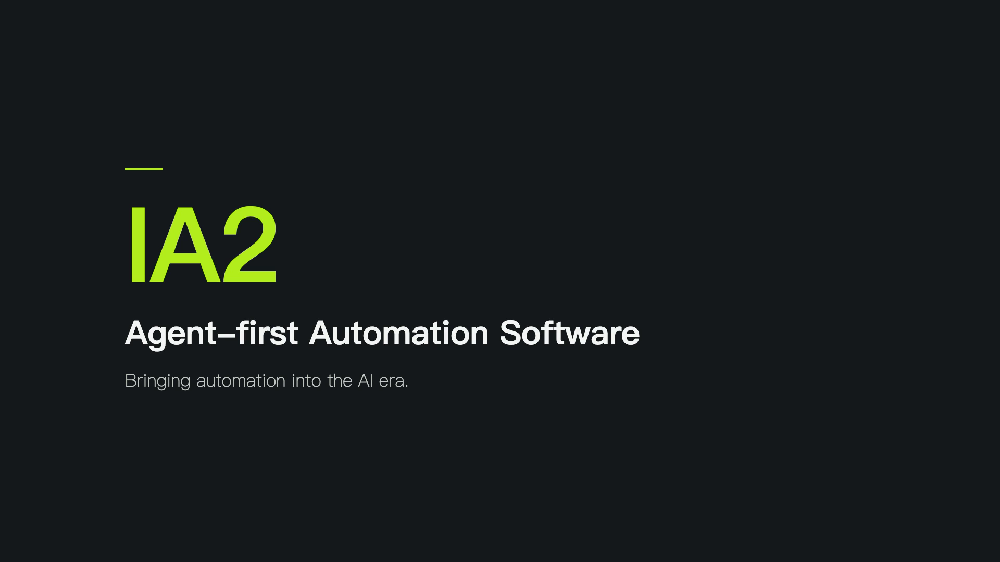

# IA2

A simple, agent-first IDE + runtime for IEC 61131-3 PLC programming.

> Positioned against Codesys / TwinCAT / Step 7 — same standard,
> 1/50 the complexity. **Agents (Claude Code, Codex, Cursor) are
> first-class users alongside humans.** Every feature reachable via
> GUI is also reachable via the `cs` CLI and the HTTP API.

[](https://www.sib-lab.dev/ia2-demo-en.mp4)

**[▶ Watch the 90-second demo](https://www.sib-lab.dev/ia2-demo-en.mp4)** — one prompt, and an agent builds a carbonation batch line end to end: writes the control logic, draws the operator screen, tests it live, ships it to the plant edge with one command — then a real-hardware chapter on a live servo bench.

The hardware claims come with receipts: [`docs/bench/`](docs/bench/) holds the measured evidence — raw CSVs, a re-derivation script, and honest evidence grades.

## Install it for your coding agent

IA2 is built so a coding agent drives it (Claude Code, Cursor, Codex…). **Two ways to install the skill:**

**A · Just tell your agent** — it runs everything below for you (installs the skill, builds the binaries, starts the server):

> **"Install the industrial-automation-skill from https://github.com/supcon-international/ia2"**

**B · Run `npx skills` yourself:**

```bash
npx skills add https://github.com/supcon-international/ia2/tree/main/.claude/skills/industrial-automation-skill
```

That's the [vercel-labs/skills](https://github.com/vercel-labs/skills) installer — it drops the skill **and its `references/` + `checklists/`** where your agent looks: `.claude/skills/` for Claude Code, the [Agent Skills](https://agentskills.io) standard `.agents/skills/` for most others (add `-g` for every project; `-a claude-code`, `-a codex`, `-a kimi-code-cli`, `-a cursor`… to pin the agent).

### The binaries — `cs` + `ia2-server`

The skill drives a small Rust CLI and a local server. Route **A** builds them for you; on route **B** (or to do it by hand) build once — needs the Rust toolchain ([rustup.rs](https://rustup.rs)):

```bash
git clone --recursive https://github.com/supcon-international/ia2
cd ia2 && ./scripts/install-skill.sh
```

`scripts/install-skill.sh` builds `cs` + `ia2-server` (plus its `lsp-launcher` sidecar for editor language support) into `~/.local/bin` (it also installs the skill, so it doubles as a no-`npx`, do-everything one-shot). Then:

Already have a clone and only want local agent discovery, with no build or network access? Run `./scripts/install-skill.sh --skill-only`. It copies the complete skill and creates the Codex-native `~/.agents/skills/industrial-automation-skill` discovery link without touching binaries or hardware.

For repository work in Codex, open the **IA2 Git root** as the workspace, or launch with `codex --cd /path/to/ia2`. Codex discovers `AGENTS.md` and repository skills by walking from its current directory up to the Git root; launching from a parent folder that merely contains the nested `ia2` checkout will not load IA2's repository contract.

1. **Start the server:** `ia2-server --bind 127.0.0.1:3001 &`
2. **Restart your agent session** so it discovers the skill.

Now just ask your agent to build a PLC program — it will author ST / LD / FBD / SFC, compile, wire Modbus / EtherCAT / OPC UA / CANopen I/O, run and debug the scan loop, and deploy to edge boxes, all through `cs`. Start with `cs --help` and the skill under `.claude/skills/industrial-automation-skill/`.

## What's in the box

| Component | Tech | Purpose |
|---|---|---|
| **`apps/web/`** | React 19 + Vite + TanStack Router + Tailwind 4 | The IDE itself, in the browser. ST / LD / FBD / SFC editors, runtime Monitor, project tree, IO mapping. Single SPA — `vite dev` in development, or served by the server itself via `--static-dir`. |
| **`crates/server/`** | Rust + axum + tower | HTTP backend (port 3001). REST + SSE. Owns the project, dispatches to ironplc-bridge, schedules tasks. |
| **`crates/cli/`** | Rust + clap + ureq | The `cs` binary — agent-first command-line. Static analysis, project CRUD, runtime debug. See `cs --help`. |
| **`crates/ironplc-bridge/`** | Rust | Wraps [ironplc](https://github.com/ironplc/ironplc) compiler + VM. Adds LD / FBD / SFC → ST transpilers + diagnostics enrichment. |
| **`crates/runtime/`** | Rust | Headless edge runtime (`ia2-runtime` binary). Same scan loop as the IDE-side bridge, plus a small HTTP monitor (health / status / logs / discover) the server reaches over SSH — no LSP, no CORS, no REST project API. Designed for Linux edge boxes. |
| **`crates/project/`** | Rust | On-disk project schema (POU files, devices, edges, iomap, tasks). |
| **`crates/iomap-modbus/` `iomap-ethercat/` `iomap-opcua/`** | Rust | I/O adapters: Modbus TCP **and RTU/serial** (tokio-modbus + tokio-serial), EtherCAT (ethercrab), **OPC UA client** (async-opcua) for supervising an existing DCS. Edge runtime publishes **northbound MQTT** (rumqttc) to supOS/Tier0. |
| **`vendor/ironplc/`** | git submodule | The compiler + VM. |

## Two interfaces, one source of truth

The HTTP API is the canonical contract. The web IDE, the CLI,
agents, and (future) MCP all talk to it. Everything is JSON; everything
is curlable.

```
                       HTTP + SSE (port 3001)
                              │
       ┌──────────────────────┼──────────────────────┐
       ▼                      ▼                      ▼
  apps/web (React)      crates/cli (`cs`)       agents (Claude
   in the browser                                 Code / Codex /
                        in terminal / CI          MCP wrappers)
```

When an agent runs `cs set pous/…`, the server emits a `Mutation`
event over SSE; the IDE's project tree updates in real time and the
editor auto-jumps to the new POU. Same in reverse: when a human saves
a POU in the IDE, an agent's `cs runtime status` sees the new symbol
table immediately.

## Agent takeover overlay

When an agent is driving, the IDE shows a pulsing green border plus a
top-centre banner so the human knows not to fight it for state. Two
modes:

- **Session mode (preferred).** `cs agent run --label "rebuilding tank
  controller" -- <cmd>` opens an explicit takeover session: the banner
  stays on with that label for the whole workflow, then drops when the
  command exits (success, failure, or Ctrl-C — a background heartbeat
  thread keeps it alive in between, and the server's 30 s watchdog
  recovers if the agent crashes). The banner's button reads **End
  session** — clicking it force-returns control to the human.
- **Transient mode (back-compat).** A single mutating `cs` subcommand
  pings `POST /api/agent/heartbeat`; the overlay flashes on with the
  command name and ages out after 3 s of silence. Fine for one-offs;
  multi-step work should use session mode so the banner doesn't strobe.

Read-only commands (`cs check`, `cs ls`, `cs get …`, `cs runtime
status/snapshot`) don't trigger the overlay — querying state isn't
"operating."

## Quickstart

### Run the IDE

```bash
# one-time
. "$HOME/.cargo/env"
pnpm install
cargo test -p server   # populates apps/web/src/types/generated/

# dev mode — two terminals
pnpm --filter @cs/web dev      # → http://localhost:3000
cargo run -p server            # → http://localhost:3001

# OR single origin: server hosts the built UI itself
pnpm --filter @cs/web build
cargo run -p server --release -- --static-dir apps/web/dist
```

### Drive it from the CLI

```bash
cargo build -p ia2-cli
alias cs=./target/debug/cs

# the mental model is bash-sized: 4 resource verbs + an API escape hatch
cs ls                                   # what resource kinds exist? (start here)
cs ls pous                              # enumerate any collection
cs get devices/plc1                     # read any resource (JSON, or raw POU source)
cs set devices/plc1 --from cfg.json     # create-or-replace (get → edit → set)
cs rm  hmi/overview                     # delete
cs api POST /api/edges/pi/attach        # anything else in docs/api.md — full parity

# author + validate (offline where possible)
cs check pous/safe_start.ld.json        # validate any language; `cs check P0002` explains a code
cs project check ~/Documents/IA2/demo   # full compile
printf '...' | cs set pous/motor.ld.json --from -   # extension picks the language
cs library import process-control --blocks fb_pid.st

# wiring / scheduling / alarms — single-doc configs, one shape each
cs set iomap  --from iomap.json         # variable ↔ device.channel bindings
cs set tasks  --from tasks.json         # PROGRAM ↔ task schedule
cs set alarms --from alarms.json        # declarative alarm definitions (alarms.toml)

# run · simulate · debug
cs run                                  # schedule everything in tasks.toml
cs sim run scenarios/fill.toml          # PROVE behaviour against the sim device layer — CI-ready
cs runtime snapshot --vars level,pump   # live values
cs runtime force pump_pct 50.0          # type-aware: REAL bit-packed, BOOL as 0/1
cs get runtime/alarms && cs runtime ack level_high
cs get runtime/history --query vars=level   # 1 Hz historian, ~2 h window
cs stop

# ship it
cs set edges/field_pi --host pi@plc.local
cs deploy field_pi                      # tar → ssh → versioned swap → systemd restart — and it
                                        # FAILS honestly if the unit didn't restart

# wrap a whole multi-step workflow in one steady takeover session
cs agent run --label "build my_line" -- bash -c 'cs project create my_line; cs set pous/...; cs run'
```

Exit codes follow Unix and are enforced uniformly: `0` clean / `1` your
content has problems (diagnostics, failed probe/deploy/sim) / `2` bad
request — including HTTP 4xx, with the server's reason printed verbatim
on stderr / `≥3` infrastructure. `--json`, `--server` and `--project`
are global flags. Every command's `--help` explains when to call it and
what to call next — written for agent readers.

## Project on disk

```
~/Documents/IA2/
└── my_project/
    ├── project.toml         metadata + version
    ├── tasks.toml           task → program scheduling
    ├── iomap.toml           variable ↔ device-channel wiring
    ├── pous/
    │   ├── cascade_pid.st         IEC Structured Text
    │   ├── motor_seal.ld.json     Ladder Diagram (JSON authored)
    │   ├── click_counter.fbd.json Function Block Diagram
    │   └── batch_sequence.sfc.json Sequential Function Chart
    ├── devices/             Modbus / EtherCAT / OPC UA / CANopen devices
    └── edges/               Deploy targets (Linux edge boxes)
```

JSON for graphical languages (not PLCopen XML) so agents and
`git diff` can read it. LD / FBD / SFC are transpiled to ST before
reaching ironplc; the intermediate ST is observable via
`cs transpile foo.ld.json`. `alarms.toml` declares alarm conditions
(limit + deadband + delay + severity) that the runtime's alarm engine
evaluates — with an ISA-18.2-shaped ack/journal lifecycle — and
`scenarios/*.toml` hold `cs sim` scenarios that prove the program's
behaviour against the simulated device layer before deploy.

## Edge deployment

`crates/runtime/` builds the `ia2-runtime` binary — headless, designed
for Linux edge boxes. Install the systemd unit (`infra/ia2.service`);
its `INSTALL_DIR` is the single source of truth for where the runtime
and project live, and the edge's `install_dir` must match it (`cs
deploy` warns on drift). `cs deploy <edge>` then tars the project over
SSH, swaps the `current` symlink atomically, and restarts the unit.

The server reaches a deployed runtime over `ssh + curl` to its HTTP
monitor: it tries the configured `runtime_port`, then falls back to
systemd — the unit's `--bind` port and `ActiveState` — so a wrong or
changed port (or a stopped service) gives a clear answer instead of a
blind failure. A transient EtherCAT bring-up timeout is retried rather
than left dead until a manual restart. See `docs/edge-deploy.md`.

## Agent skill (Claude Code · Codex · Kimi Code · Cursor · …)

The repo ships an [Agent Skills](https://agentskills.io)-format skill at
**`.claude/skills/industrial-automation-skill/`** (canonical copy),
mirrored at **`.agents/skills/industrial-automation-skill`** — the
standard path [Codex](https://developers.openai.com/codex/skills), Kimi Code, Cursor, Gemini CLI and others scan.
The mirror is a committed symlink, so it needs a symlink-capable
checkout (on Windows: `core.symlinks=true` / Developer Mode) —
without one, point your agent at the canonical `.claude/skills/`
copy, which always works.
Repo-root **`AGENTS.md`** (which `CLAUDE.md` imports) is the working
contract for changing this repo and points agents whose harness doesn't
scan skill directories at the skill by hand.

In Claude Code the skill auto-loads on PLC/automation work matching the
skill's description (words like "IEC 61131-3", "PLC", "Modbus",
"EtherCAT", "cs CLI"); in
Codex / Kimi Code it's discovered from `.agents/skills` (implicitly by
description match, or explicitly as `$industrial-automation-skill` in
Codex, or `/skill:industrial-automation-skill` in hosts that use that
syntax). Either way it teaches the agent
the whole `cs` workflow: the meta-primitive mental model (`ls/get/set/rm` + `api`),
the mandatory `cs agent run` session pattern, end-to-end recipes
including scenario simulation and alarms/history, the exact
device/iomap/tasks/alarms JSON shapes, IEC 61131-3 quirks ironplc
actually accepts, and a troubleshooting table. It also carries three
checklists: `first-contact` (find the local server port, see what's
open), `offline-readiness` (separate simulation proof from bench
evidence), and `handoff` (compile clean, release forces, report state)
— so an agent starts and finishes a task the right way.

It's committed (not gitignored) so every contributor and CI agent gets
the same playbook. Skim `SKILL.md` to see what an agent is told. Run
`./scripts/check-agent-adaptation.sh` for an offline contract check of
`AGENTS.md`, skill metadata, repository discovery, and the skill-only
installer; the check never contacts a server, network, or hardware.

## Design principles

Read `MEMORY/principles.md` first if you're contributing. The headline:

1. **Simplicity is the headline feature.** Defaults work without
   configuration. One concept per screen. No "advanced settings."
2. **Agent-friendly is co-equal with human-friendly.** Anything
   the GUI does, the CLI + HTTP API also do.
3. **Text-first storage.** ST as `.st`, graphical languages as JSON.
   `grep`, `git diff`, `cat` all work.

## License

Apache-2.0. As the beautiful upstream `ironplc/` software developed by Mr.Garret Fick is also Apache-2.0.
